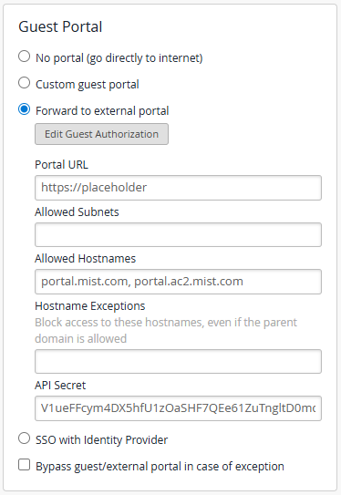
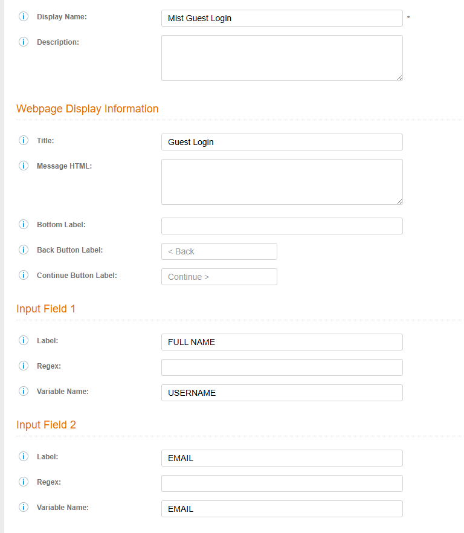
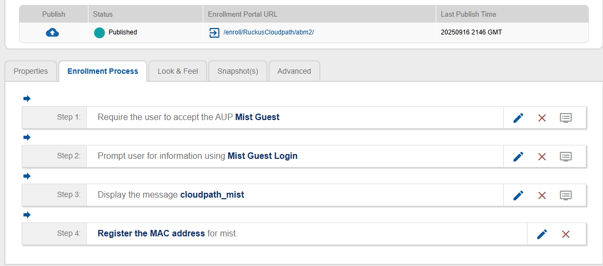

# Cloudpath Mist Integration

This repository contains a custom Cloudpath template that integrates with Mist's external guest portal functionality.

## Table of Contents

- [Files](#files)
- [Features](#features)
- [How It Works](#how-it-works)
- [Technical Details](#technical-details)
- [Usage](#usage)
- [Mist Configuration](#mist-configuration)
- [Configuration](#configuration)
  - [MIST Configuration](#mist-configuration-1)
  - [Cloudpath Configuration](#cloudpath-configuration)
- [Security Note](#security-note)
- [Disclaimer](#disclaimer)

## Files

- `cloudpath_mist.html` - The main Cloudpath template with Mist integration

## Features

- **Credential Verification Page**: Displays user information for verification before proceeding
- **Mist Authorization**: Generates proper HMAC-SHA1 signatures for Mist portal authorization
- **Cloudpath Integration**: Uses standard Cloudpath CSS classes and form submission flow
- **User-Friendly Interface**: Clean, professional verification interface with Continue/Back buttons

## How It Works

1. User reaches the credential verification page
2. Page displays their name and email for confirmation
3. When "Confirm & Continue" is clicked:
   - Generates Mist authorization URL with proper HMAC-SHA1 signature
   - Submits Cloudpath form with Mist URL as `RETURN_URL`
   - Cloudpath handles the redirect to Mist portal

## Technical Details

- Uses Web Crypto API for HMAC-SHA1 signature generation
- Follows Mist's external guest portal specification
- Compatible with Cloudpath template system
- Supports all standard Cloudpath variables and functionality

## Usage

1. Upload `cloudpath_mist.html` to your Cloudpath system
2. Configure as a message template in your Cloudpath workflow
3. Ensure Mist variables are properly passed through Cloudpath
4. Set the Mist secret key in the template (currently hardcoded)

## Mist Configuration

The template expects the following Mist variables to be available:
- `wlan_id`
- `ap_mac` 
- `client_mac`
- `url`
- `ap_name`
- `site_name`
- `authorize_url`
- `CLIENT_IP`

## Configuration

Before using this template, you must configure your Mist WLAN API Key:

### MIST Configuration:
- Create a new WLAN for your environment in Mist Dashboard.
- Under Guest Portal, select Forward to external portal
- Create an arbitrary Portal URL for now, as we just need to gather the API Secret for the Cloudpath setup.  We will revisit this later.
- Add `portal.mist.com, portal.ac2.mist.com` to the Allowed Hostnames
- Create your WLAN

### Cloudpath Configuration

1. Open `cloudpath_mist.html` in a text editor
2. Find the line: `const MIST_SECRET = 'YOUR_MIST_WLAN_API_KEY_HERE';`
3. Replace `YOUR_MIST_WLAN_API_KEY_HERE` with your actual Mist WLAN API Key
4. Save the file
5. Create a new Workflow in CloudPath
6. Ensure your Workflow has a data prompt page by creating a new step and selecting "Prompt the user for information"
7. The new prompt step should have 2 input fields with USERNAME and EMAIL as the variables:

8. After the prompt step, create a message step by selecting the "Display a message" type
9. Select "A new messages created by uploading an HTML file and select your cloudpath_mist.html file.
10. Publish your new workflow and take note of the Enrollment Portal URL.  You will need this for the MIST setup.

11. Return to MIST and enter your Portal URL under Guest Portal.

# Security Note

The MIST API Key will be visible in the web source.  It could allow attackers to bypass CloudPath and create authorized devices by formatting the correct URL for MIST.  This should just be considered a workaround until CloudPath implements a production version with server-side processing.  The author considers the risk to be low, but not non-existent.

## Disclaimer

This project is an independent work created by the author and is not affiliated with, endorsed by, or officially supported by Ruckus Wireless, CommScope, or Mist Systems. This is a community-contributed solution for integrating Cloudpath with Mist's external guest portal functionality. Use at your own discretion and ensure compatibility with your specific environment before deploying in production.
